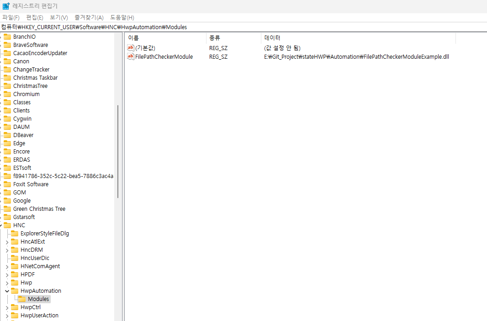

# dtro_statevl
# 대구교통공사 상태 평가 모듈

본 프로젝트는 **상세 시설물 상태 평가 (dtro_dtl_statevl)** 와 **전체 시설물 상태 평가 (dtro_total_statevl)** 를 위한 스크립트를 제공합니다.  

---

## 🚀 시작하기

**1. 한글(Hancom) 설치 필수**  
**2. 한글 컨트롤용 보안승인 모듈 등록**  
- 레지스트리 편집기 열기  
- 경로: `컴퓨터\HKEY_CURRENT_USER\Software\HNC\HwpAutomation\Modules`  
- 이름: `FilePathCheckerModule`  
- 값: Automation 폴더 안의 DLL 파일 등록  

**3. 한글 오토메이션용 보안승인 모듈 등록**  



---

## ⚙️ 필수 설치 패키지

```bash
    pip install pandas
    pip install pywin32
```

## 💡 실행
이 스크립트는 명령줄 인수를 통해 실행됩니다.
루트 경로는 INSULATOR 전까지의 경로입니다.

**dtro_condition_report.py**

```bash
    python dtro_condition_report.py --root-dir "e:/Git_Project/대구교통공사_stateHWP/INSULATOR"  --project-id 3  --script-dir "e:/Git_Project/대구교통공사_stateHWP"
```

**dtro_dtl_statevl.py**

```bash
    python e:/Git_Project/대구교통공사_stateHWP/dtro_dtl_statevl.py --root-dir "e:/Git_Project/대구교통공사_stateHWP/INSULATOR" --project-id 3 --sub-project-id "ST3_MPY_PSS"
```

**dtro_total_statevl.py**

```bash
    C:/Python313/python.exe e:/Git_Project/대구교통공사_stateHWP/dtro_total_statevl.py --root-dir "e:/Git_Project/대구교통공사_stateHWP/INSULATOR" --project-id 3
```
